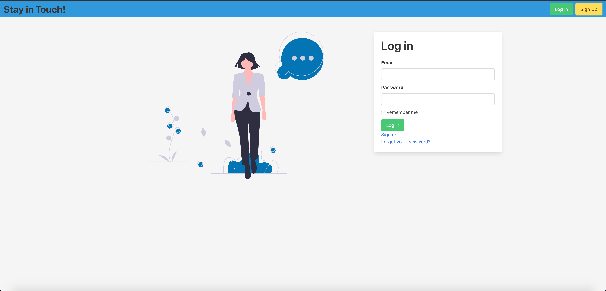

# Stay in Touch!

> Stay in Touch! is a social media app built with Ruby on Rails. Users can send friendship invitations to other users, create, like and comment posts.



## Built With

- Ruby v2.7.0
- Ruby on Rails v5.2.4

## Live Demo

TBA


## Getting Started

To get a local copy up and running follow these simple example steps.

### Prerequisites

Ruby: 2.6.3
Rails: 5.2.3
Postgres: >=9.5

### Setup

> Run the following command in your terminal to get a local copy of the repo on your local machine.

```bash
  $ git clone https://github.com/rsundar/ror-social-scaffold.git
```

Instal gems with:

```
bundle install
```

Setup database with:

```
   rails db:create
   rails db:migrate
```

### Usage

Start server with:

```
    rails server
```

Open `http://localhost:3000/` in your browser.

### Run tests

```
    rpsec --format documentation
```

### Deployment

TBA

## Authors

👤 **Rohan Sundar**

- Github: [@rsundar](https://github.com/rsundar)
- Twitter: [@skelegrow](https://twitter.com/)
- Linkedin: [linkedin](https://linkedin.com/)

👤 **Mario Barrios**

- Github: [@mariobarrioss](https://github.com/mariobarrioss)
- Twitter: [@mario_barrioss](https://twitter.com/)
- Linkedin: [linkedin](https://linkedin.com/)

## 🤝 Contributing

Contributions, issues and feature requests are welcome!

Feel free to check the [issues page](issues/).

## Show your support

Give a ⭐️ if you like this project!

## 📝 License

This project is [MIT](https://github.com/rsundar/ror-social-scaffold/LICENSE) licensed.
